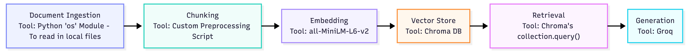

# Project 1 Planning: The Unofficial Guide

> Write this document before you write any pipeline code.
> Your spec and architecture diagram are what you'll use to direct AI tools (Claude, Copilot, etc.) to generate your implementation — the more specific they are, the more useful the generated code will be.
> Update the Retrieval Approach and Chunking Strategy sections if you change your approach during implementation.
> Update this file before starting any stretch features.

---

## Domain

<!-- What domain did you choose? Why is this knowledge valuable and hard to find through official channels? -->
My unofficial guide will focus on the domain of student reviews of University of Flordia Liguistics department professors. Professor reviews are not published on official university sites and are often pass on between students through word-of-mouth or online forums. 

---

## Documents

<!-- List your specific sources: URLs, subreddit names, forum threads, or file descriptions.
     Aim for at least 10 sources that together cover different subtopics or perspectives within your domain. -->

| # | Source | Description | URL or location |
|---|--------|-------------|-----------------|
| 1 | Rate my Professor | Reviews for Professor Edith Kaan | https://www.ratemyprofessors.com/professor/729200 |
| 2 | Rate my Professor | Reviews for Professor Sarah Moeller | https://www.ratemyprofessors.com/professor/2069291 |
| 3 | Rate my Professor | Reviews for Professor Eleonora Rossi | https://www.ratemyprofessors.com/professor/2657746 |
| 4 | Rate my Professor | Reviews for Professor Jamie Garner | https://www.ratemyprofessors.com/professor/2469970 |
| 5 | Rate my Professor | Reviews for Professor Paula Golombek | https://www.ratemyprofessors.com/professor/1854514 |
| 6 | Rate my Professor | Reviews for Professor Hannah Treadway | https://www.ratemyprofessors.com/professor/2763389 |
| 7 | Rate my Professor | Reviews for Professor Steffi Wulff | https://www.ratemyprofessors.com/professor/1854516 |
| 8 | Rate my Professor | Reviews for Professor Ethan Kutlu | https://www.ratemyprofessors.com/professor/2184150 |
| 9 | Rate my Professor | Reviews for Professor Alexandrine Dunlap | https://www.ratemyprofessors.com/professor/2967403 |
| 10 | Rate my Professor | Reviews for Professor Imanol Suarez-Palma | https://www.ratemyprofessors.com/professor/2573403 |

---

## Chunking Strategy

<!-- How will you split documents into chunks?
     State your chunk size (in tokens or characters), overlap size, and explain why those
     numbers fit the structure of your documents.
     A review-heavy corpus warrants different chunking than a long FAQ. -->

**Chunk size:**
128

**Overlap:**
0

**Reasoning:**
Based on the structure of reviews on Rate my Professor, I have decided to use a document-aware chunking strategy. It will treat each review as an individual chunk. This makes sense as it isolates and contians the context behind each review. Whereas other approaches may groups reviews together if they are similar despite being different opinions (semantic approach) or lose site of document-dependent boundaries of information (fixed-size and recursive approach).
---

## Retrieval Approach

<!-- Which embedding model are you using (e.g., all-MiniLM-L6-v2 via sentence-transformers)?
     How many chunks will you retrieve per query (top-k)?
     If you were deploying this for real users and cost wasn't a constraint, what tradeoffs
     would you weigh in choosing a different embedding model — context length, multilingual
     support, accuracy on domain-specific text, latency? -->

**Embedding model:**
all-MiniLM-L6-v2 via sentence-transformers

**Top-k:**
6

**Production tradeoff reflection:**
To avoid uneccsary computation cost derieved from an overly complex model, take into consideration that my task data consits of mono-lingual English reviews, text sequence that would likly not go over 256 tokens, and limited meaning variation to require large multi-dimensional models. For that reason, I decide to use all-MiniLM-L6-v2 via sentence-transformers.

---

## Evaluation Plan

<!-- List your 5 test questions with their expected correct answers.
     Questions should be specific enough that you can judge whether the system's response
     is right or wrong. "What are good dining halls?" is too vague.
     "What do students say about wait times at [dining hall name] during lunch?" is testable. -->

| # | Question | Expected answer |
|---|----------|-----------------|
| 1 | How do student feel about the work load in Professor Kaan's classes? | Most say it is a lot of homework and she can be a harsh grader.|
| 2 | Any suggestions from students for taking a class with Edith Kaan? | Students suggest staying up to date with homework and readings, as well as asking for the study guide in advance. |
| 3 | How do students feel about Jaime Garner's LIN2011 course? | Reviews for this specifc course were overall positive with students praising her lectures and minimal workload. |
| 4 | Does Ethan Kutlu still work at UF | No, reviews suggest that while Dr. Kutlu did once work at UF, he now is in the linguistics department at Pitt. |
| 5 | What is the overall rating of professor David Pharies | Based on 3 total reviews,  the overall rating is 2.7 out of 5 |

---

## Anticipated Challenges

<!-- What could go wrong? Name at least two specific risks with reasoning.
     Consider: noisy or inconsistent documents, missing source attribution, off-topic
     retrieval, chunks that split key information across boundaries. -->

1. Since information is limited to what is in the reviews, student question about specific aspect of a professor's course may or may not be available.

2. Since each review is its own chunk, minority opinions may fail be showcased due to top-k limit and retrieval may be clouded by various similar response that have higher cosine similarity to the query.

---

## Architecture

<!-- Draw a diagram of your pipeline showing the five stages:
     Document Ingestion → Chunking → Embedding + Vector Store → Retrieval → Generation
     Label each stage with the tool or library you're using.
     You can use ASCII art, a Mermaid diagram, or embed a sketch as an image.
     You'll use this diagram as context when prompting AI tools to implement each stage. -->

---

## AI Tool Plan

<!-- For each part of the pipeline below, describe:
     - Which AI tool you plan to use (Claude, Copilot, ChatGPT, etc.)
     - What you'll give it as input (which sections of this planning.md, which requirements)
     - What you expect it to produce
     - How you'll verify the output matches your spec

     "I'll use AI to help me code" is not a plan.
     "I'll give Claude my Chunking Strategy section and ask it to implement chunk_text()
     with my specified chunk size and overlap" is a plan. -->

**Milestone 3 — Ingestion and chunking:**
I will be using Claude. I will provide the Chunking Strategy sections of this planning document and also provide a thourogh break down of the kind of data I am working with. Also, since I would like to take a more customized approach to ingestion and chunking, I will provide an example html file so it can provide code specific to the Rate my Professor pages' parsing needs. I am expacting the tool to produce code to one, ingest and parser the pages and two, create content-aware chunking script. I will verify this matches the spec by analyzing each step of the code and final output, ensuring the product is as anticipated and can fit well into the next step, embedding.

**Milestone 4 — Embedding and retrieval:**
I will be using Claude. I will provide the Retrieval Approach section of this planning document, my architecture diagram which names each tool/ library I intended to use for each step of the process, and the chunks.json output from the previous milestone so the tool can see a clear visual of the data it is working with. I am expecting the tool to produce three scripts: one to embed text with all-MiniLM-L6-v2 via sentence-transformers, one to load the chunks into a persistent Chroma DB store, and one to retrieve the top-k most similar chunks for a query. I specifically will request the retrieval script to print debugging output for each query, that being the chunks it pulled and their distance scores to gage retrieval quality. I will verify this matches the spec by running the build and querying the five test questions as intended, checking that the retrieved chunks are relevant and that distance scores are valid (not reaching 0.6). 

Minor note following prompting: Chroma metadata only accepts scalar values, so the `tags` list is joined into a string and the occasionally-null `would_take_again` field is dropped during ingestion into the store.

**Milestone 5 — Generation and interface:**
